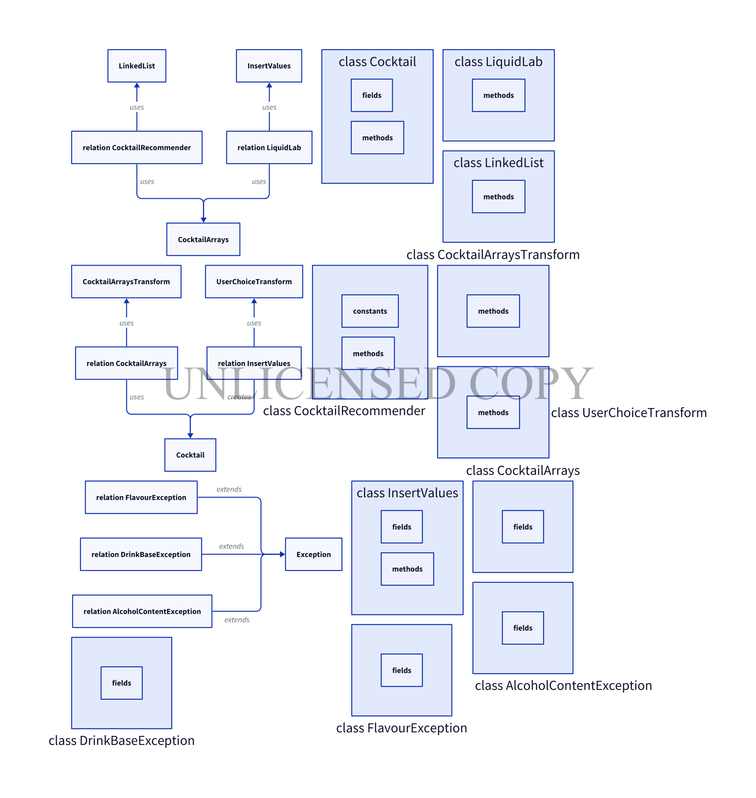

# liquidlab

## Compilation instructions 
To compile LiquidLab.java, from the command line run the following command (you should navigate to: /liquidlab/src/main/java):
 javac LiquidLab.java

## Execution instructions
To run LiquidLab, from the command line run the following command:
 java LiquidLab

## usage instructions
In order to use properly the programm you have to enter your preferences according to the options we provide you

## The structure of the repository's files is the following

├── src
│   └── main
│       └── java
│           ├── AlcoholContentException.java
│           ├── Cocktail.java
│           ├── CocktailArrays.java
│           ├── CocktailArraysTransform.java
│           ├── CocktailRecommender.java
│           ├── DrinkBaseException.java
│           ├── FlavourException.java
│           ├── InsertValues.java
│           ├── LiquidLab.java
│           └── UserChoiceTransform.java
├── test
│   └── java
│       └── det
│           ├── CocktailRecommenderTest.java
│           ├── CocktailArraysTransformTest.java
│           └── UserChoiceTransform.java
├── images
├── target
├── pom.xml
└── README.md

## The uml diagram

## data structures
- Arrays
cocktailsNames[] includes the names of the cocktails
cocktailIng[][] includes the ingridients of the cocktails
transform[][] transform the bases,flavours,intensity in a number for easier transformation

- Index
LinkedList stores the indexes of the cocktailsNames[] and finds the final index

## Licenses
This project is licenced by: GNU General Public License v3.0.  
[εδώ](https://www.gnu.org/licenses/gpl-3.0.html).

